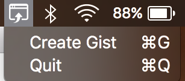

# macGist
macGist is a simple app that sends your clipboard to GitHub's Gist and automatically copy the Gist URL into your Clipboard.. 

Be aware that it will replace your current clipboard with the Gist URL!

# Installation
You can download an unsigned version of the app [here](https://github.com/Bunn/macGist/releases/latest)

# Screenshots

